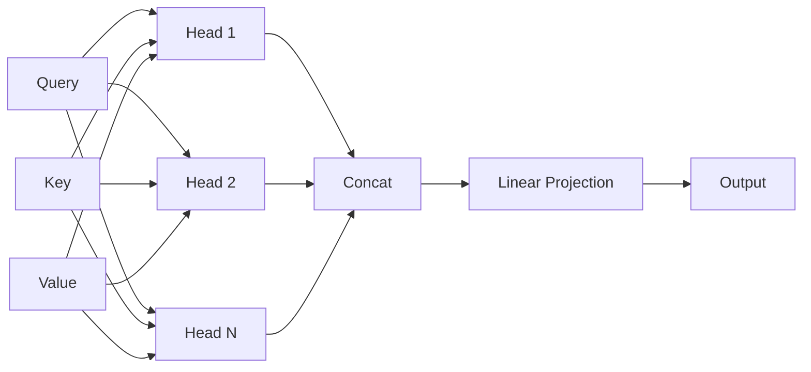

# Attention Mechanism

> A mechanism that allows a neural network to focus on relevant parts of its input when producing each element of its output, by computing a weighted combination of value vectors based on query-key compatibility.

## Overview

Attention is the fundamental operation at the heart of the [[transformer-architecture]]. At its core, attention answers the question: "Given what I'm currently processing (query), which parts of the input (keys) are most relevant, and what information (values) should I aggregate from them?"

The mechanism was first introduced for sequence-to-sequence models by Bahdanau et al. (2014) as a way to help neural machine translation models handle long sentences. Rather than compressing an entire input sentence into a single fixed-length vector, attention allows the decoder to look back at all encoder positions and focus on the most relevant ones for each output word.

The Transformer architecture (Vaswani et al., 2017) generalized this idea into *self-attention* -- where a sequence attends to itself -- and demonstrated that attention alone, without recurrence, is sufficient for state-of-the-art sequence modeling.

## Key Ideas

- **Query, Key, Value (QKV)** -- Every attention operation involves three projections of the input: queries (what am I looking for?), keys (what do I contain?), and values (what information do I provide?).
- **Scaled dot-product** -- Compatibility between queries and keys is computed as a dot product, scaled by the square root of the dimension to prevent gradients from vanishing in softmax.
- **Multi-head attention** -- Instead of a single attention function, the model runs several attention heads in parallel, each with its own learned QKV projections. This allows the model to attend to information from different representation subspaces.
- **Self-attention vs cross-attention** -- Self-attention attends within a single sequence. Cross-attention attends from one sequence (decoder) to another (encoder).
- **Causal masking** -- In autoregressive models (like GPT), attention is masked so that position `i` can only attend to positions `<= i`, preventing information leakage from the future.

## How It Works

### Scaled Dot-Product Attention

Given matrices Q (queries), K (keys), and V (values):

```
Attention(Q, K, V) = softmax(QK^T / sqrt(d_k)) V
```

Step by step:

1. Compute dot products between all query-key pairs: `QK^T`
2. Scale by `1/sqrt(d_k)` to stabilize gradients
3. Apply softmax to get attention weights (each row sums to 1)
4. Multiply weights by values to get the weighted combination

### Multi-Head Attention

```
MultiHead(Q, K, V) = Concat(head_1, ..., head_h) W^O
where head_i = Attention(QW_i^Q, KW_i^K, VW_i^V)
```

Each head learns different projection matrices, enabling the model to simultaneously attend to different aspects of the input (e.g., syntactic structure in one head, semantic similarity in another).



## Why It Matters

Attention mechanisms solved several critical problems in sequence modeling:

1. **Long-range dependencies** -- RNNs struggle with long sequences because information must pass through many sequential steps. Attention provides direct connections between any two positions.
2. **Parallelization** -- Self-attention can be computed for all positions simultaneously, unlike RNNs which must process tokens one at a time.
3. **Interpretability** -- Attention weights provide a (rough) window into what the model is "focusing on," which is useful for debugging and analysis.
4. **Flexibility** -- The same attention mechanism works across modalities: text, images, audio, protein sequences.

## Common Misconceptions

- **"Attention weights show what the model is thinking"** -- Attention weights indicate how information flows but do not straightforwardly correspond to importance or reasoning. Research shows they can be misleading as explanations.
- **"More heads are always better"** -- Some research (Michel et al., 2019) shows that many attention heads can be pruned at inference time with minimal quality loss, suggesting redundancy.
- **"Attention is O(n^2)"** -- The standard formulation has quadratic complexity in sequence length. Many variants (linear attention, sparse attention, FlashAttention) address this, but the quadratic cost remains a fundamental consideration for very long sequences.

## Connections

- Core component of the [[transformer-architecture]]
- Variants: sparse attention, linear attention, local attention, sliding window attention
- FlashAttention is an important hardware-aware optimization that computes exact attention with reduced memory usage

## Further Reading

- Bahdanau et al., "Neural Machine Translation by Jointly Learning to Align and Translate" (2014) -- Original attention for NMT
- Vaswani et al., "Attention Is All You Need" (2017) -- Self-attention and multi-head attention
- "The Illustrated Attention" by Jay Alammar -- Visual guide

---
*Compiled from: [[attention-is-all-you-need]]*
