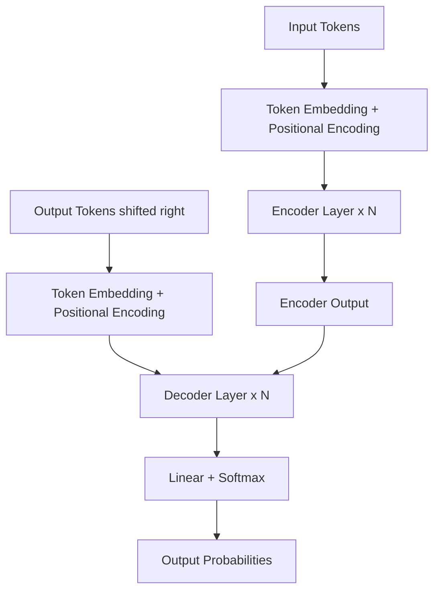

# Transformer Architecture

> A neural network architecture that processes sequences entirely through attention mechanisms, eliminating the need for recurrence or convolution.

## Overview

The Transformer is a sequence-to-sequence architecture introduced by Vaswani et al. in 2017. It was originally designed for machine translation but has since become the foundation of nearly all modern language models, including GPT, BERT, PaLM, and Claude.

The key insight is that sequential processing (as in RNNs) is not necessary for modeling dependencies in sequences. Instead, the Transformer uses [[attention-mechanism|attention]] to directly relate any two positions in a sequence, regardless of distance. This enables massive parallelization during training and allows the model to capture long-range dependencies more effectively.

The architecture follows an encoder-decoder structure, though many modern variants use only the encoder (BERT) or only the decoder (GPT).

## Key Ideas

- **No recurrence** -- Unlike RNNs and LSTMs, the Transformer processes all positions in parallel. This dramatically speeds up training on modern hardware.
- **Self-attention as the core operation** -- Each layer applies [[attention-mechanism|multi-head self-attention]] followed by a position-wise feed-forward network.
- **Positional encoding** -- Since the architecture has no inherent notion of order, positional information is injected via sinusoidal functions (or learned embeddings in later variants).
- **Residual connections and layer normalization** -- Every sub-layer (attention, feed-forward) is wrapped in a residual connection followed by layer normalization, stabilizing deep networks.
- **Scaling** -- The architecture scales predictably: more layers, wider dimensions, and more heads generally improve performance, following scaling laws.

## How It Works

The Transformer processes input in the following stages:

1. **Input embedding**: Tokens are converted to dense vectors
2. **Positional encoding**: Position information is added to embeddings
3. **Encoder stack** (N layers, each containing):
   - Multi-head self-attention
   - Add & normalize (residual connection)
   - Feed-forward network
   - Add & normalize (residual connection)
4. **Decoder stack** (N layers, each containing):
   - Masked multi-head self-attention
   - Add & normalize
   - Multi-head cross-attention (attending to encoder output)
   - Add & normalize
   - Feed-forward network
   - Add & normalize
5. **Output linear layer + softmax**: Produces probability distribution over vocabulary

## Why It Matters

The Transformer is arguably the most consequential neural network architecture since backpropagation. Its impact spans:

- **NLP**: BERT, GPT, T5, and virtually all modern language models
- **Computer vision**: Vision Transformers (ViT), DINO, Segment Anything
- **Speech**: Whisper, wav2vec 2.0
- **Multimodal**: CLIP, DALL-E, Flamingo
- **Science**: AlphaFold 2 (protein structure prediction)

The architecture's ability to scale efficiently with compute and data has made it the backbone of the current era of foundation models.

## Common Misconceptions

- **"Transformers understand language"** -- Transformers learn statistical patterns in sequences. Whether this constitutes "understanding" is a matter of ongoing philosophical debate.
- **"Attention is all you need"** -- While catchy, the feed-forward layers contain the majority of the model's parameters and play a critical role. Attention alone is not sufficient.
- **"Bigger is always better"** -- While scaling laws show predictable improvements, efficiency techniques (distillation, pruning, architecture search) can achieve comparable performance at lower cost.

## Connections

- Core mechanism: [[attention-mechanism]] -- The Transformer is built entirely around attention
- The original paper compared Transformers favorably against RNNs and CNNs for sequence tasks

## Further Reading

- Vaswani et al., "Attention Is All You Need" (2017) -- The original paper
- "The Illustrated Transformer" by Jay Alammar -- Excellent visual walkthrough
- "Formal Algorithms for Transformers" by Mary Phuong and Marcus Hutter -- Rigorous mathematical treatment

---
*Compiled from: [[attention-is-all-you-need]]*
