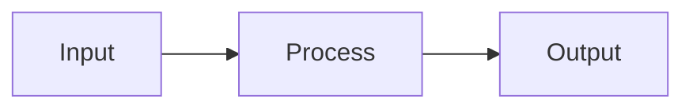

# {{CONCEPT_NAME}}

> One-sentence summary of what this concept is.

## Overview

A 2-3 paragraph explanation of the concept, accessible to someone with general technical background but not necessarily domain expertise.

## Key Ideas

- **Idea 1** -- Explanation
- **Idea 2** -- Explanation
- **Idea 3** -- Explanation

## How It Works

Step-by-step or mechanistic explanation. Use diagrams (Mermaid) where helpful.

## Why It Matters

Explain the significance -- why should someone care about this concept? What problems does it solve?

## Common Misconceptions

- **Misconception**: Correction
- **Misconception**: Correction

## Connections

- Related to [[related-concept-1]] because...
- Builds on [[related-concept-2]] by...
- Contrast with [[related-concept-3]] which instead...

## Further Reading

- Source 1
- Source 2

---
*Compiled from: [[source-1]], [[source-2]]*
